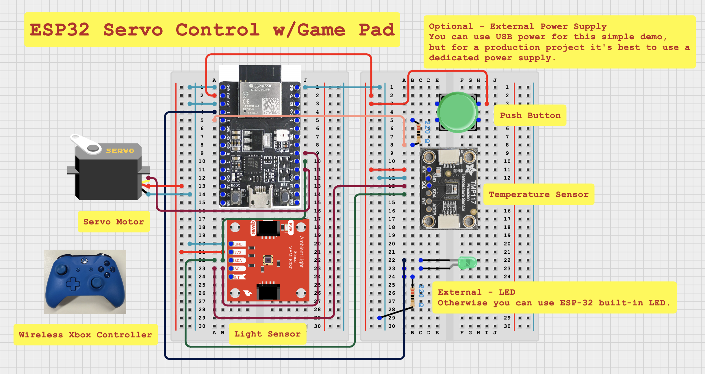

# ESP32 Game Servo Control with Game Controller (esp32_remote_servo_control)

This example demonstrates how you can use a Bluetooth Low Energy (BLE) game controller to operate an LED and a servo motor. We will configure the left joystick on the controller to operate the servo and use the buttons to operate the LED.

## What you will need -

- ESP-32 Development Board (Note original ESP32 can connect to both classic Bluetooth and BLE Devices other kits like S3 or C3 can only interface with BLE controllers)
- Xbox One Wireless COntroller
- Servo Motor
- LED (Optional - you can use the onboard LED if you wish)
- 220 Ohm Resistor (Optional)
- Breadboard (Optional)

## Circuit Diagram

