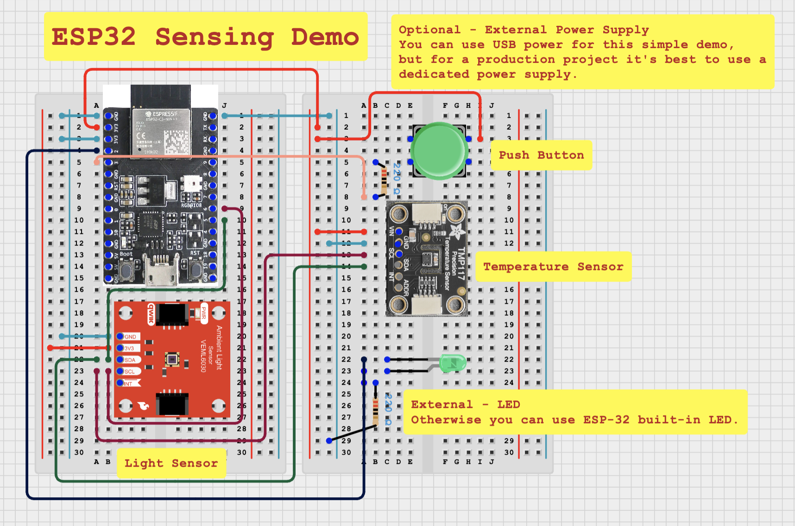

# ESP32 Sensing (esp32_sensing)

This example demonstrates how you can use sensors to control an LED. The example is written for a VEML6030 light sensor and a TMP117 temperature sensor. We will configure both a sensed and manual control mechanism for the light (using a push button).

## What you will need -

- ESP-32 Development Board (Note original ESP32 can connect to both classic Bluetooth and BLE Devices other kits like S3 or C3 can only interface with BLE controllers)
- VEML6030 Light Sensor
- TMP117 Temperature sensor
- Push Button
- LED (Optional - you can use the onboard LED if you wish)
- 220 Ohm Resistor (Optional)
- Breadboard (Optional)

## Circuit Diagram

