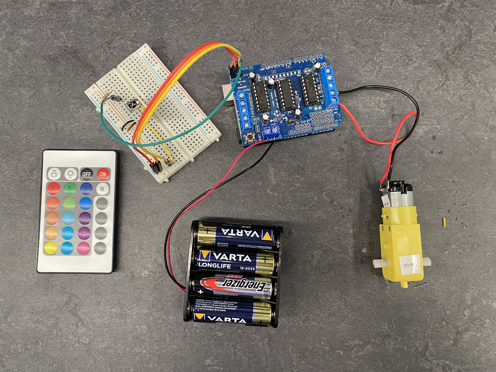
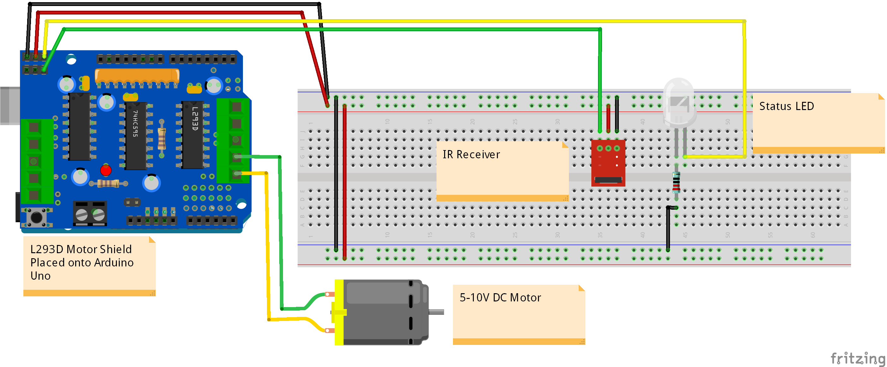

# IR Motor Control (motor_control_demo)

This example demonstrates how an IR controller can be used to easily control some type of motor using a PWM Signal.

## What you will need -

- Arduino Uno
- IR Receiver
- IR Remote
- Motor/Winch
- Motor Shield (Or other adequate power source)
- LED
- 220 Ohm Resistor

## Circuit Diagram

