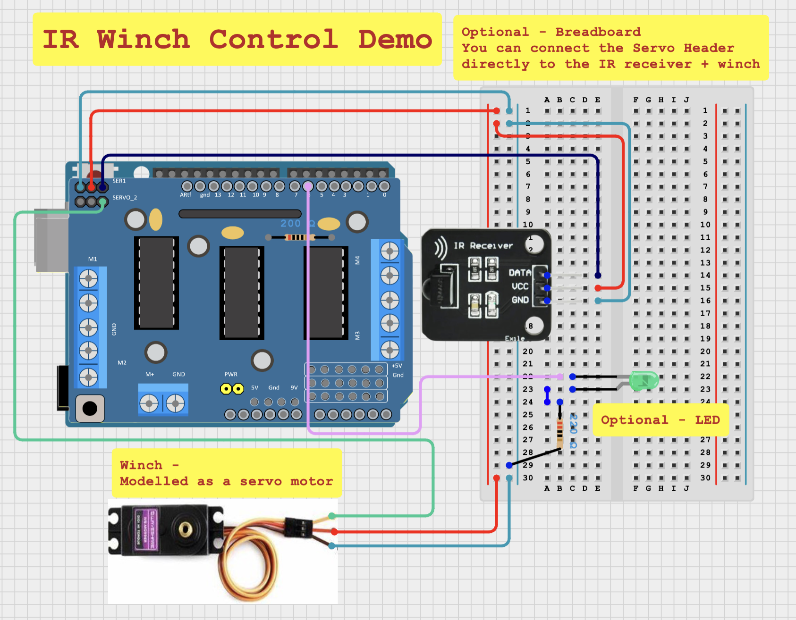

# IR Winch Control (winch_control_demo)

<!--  -->

This example demonstrates how an IR controller can be used to easily control a winch (or servo motor) using a PWM signal.

## What you will need -

- Arduino Uno
- IR Receiver
- IR Remote
- Servo Motor/Winch
- Motor Shield (Or other adequate power source)
- LED (Optional)
- 220 Ohm Resistor (Optional)
- Breadboard (Optional)

## Circuit Diagram

[Click here for an interactive viewer!](https://app.cirkitdesigner.com/project/45640246-2843-42db-9cdd-673c36bb35af)